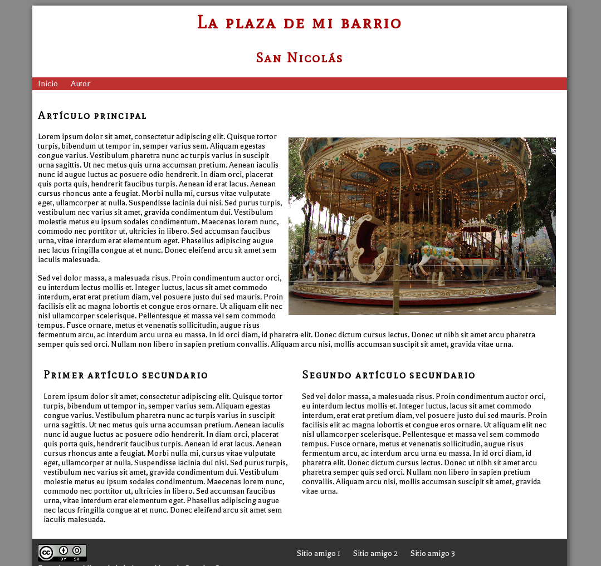
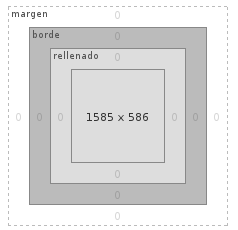

## Qué necesitamos

No se necesita nada especial para poder crear una página web. Tan solo con un editor de texto simple (no el word o libreoffice, si no el notepad) se pueden crear páginas web. Y un navegador para poder ir viendo qué estamos haciendo.

Si quieren una herramienta con algunas ayudas[^1], hay algunos editores de software libre que pueden ser útiles, como [Atom](https://atom.io/), [Brackets](http://brackets.io/) o [Visual Studio Code](https://code.visualstudio.com/). También hay uno muy conocido que es gratis, pero no libre, llamado [Sublime Text](https://www.sublimetext.com/)[^2]. Los tres tienen versiones para los principales sistemas operativos.

## Cómo funciona Internet

Como ya hemos visto en clase, cuando escribimos la url de un sitio en el navegador (www.lanacion.com.ar), hay una serie de pasos de búsqeuda de dónde está esa información, y una vez alcanzada la dirección, el servidor devuelve un archivo con extensión .html que es el que va a interpretar el navegador.

El HTML es un lenguaje de marcado, ¿pero qué significa esto? Que para que el navegador sepa cómo debe representar la página, nosotros debemos indicarle mediante «etiquetas» cuál es la función que le damos a cada texto que incluimos. Por ejemplo, si queremos decirle que algo forma parte de un párrafo, a ese texto lo englobamos dentro de las etiquetas ```<p>``` y ```</p>```, que es la que indica cuando termina el párrafo:

```<p>Esto es un párrafo</p>```

Existen muchas etiquetas que iremos viendo a lo largo del proceso, y muchas otras que no alcanzaremos a ver y que podrán investigar posteriormente. Sin más dilaciones vayamos al primer paso: el boceto de lo que queremos hacer.



Un navegador reacciona de forma diferente ante tipos de archivos diferentes. Por ejemplo, cuando abrimos un sitio web, como dijimos, interpreta un archivo html y lo muestra. Pero si nos dirigimos a un archivo que termina en .jpg o .png, que son formatos de imágenes, tiene que mostrarnos una imagen.

Para que sepa que lo que recibe es una página web y que tiene que interpretarla, en el comienzo de nuestro documento tenemos que agregar el siguiente texto:

```<!DOCTYPE html>```

Con esta simple línea de texto, el navegador ya sabe que lo que sigue está escrito en HTML y tiene que interpretarlo para mostrárnoslo como una página web. 

Enseguida después tenemos que agregar la etiqueta <html> que define el comienzo de nuestra página. Una página web se divide, principalmente en dos partes: la cabeza, algo que no vemos los usuarios cuando entramos a la página, contiene información necesaria para el navegador y los buscadores. Se la identifica con la etiqueta <head>.

La otra parte es donde irá el contenido que verán los usuarios y se la identifica con la etiqueta <body>. Por lo tanto, nuestro documento debería estar en este momento de la siguiente forma:

```
<!DOCTYPE html>
<html>
	<head>
	</head>
	<body>
	</body>
</html>
```

Guardamos el archivo con el nombre que queramos y la terminación .html y la podremos abrir con el navegador. Por ejemplo mipagina.html (no se recomienda agregar espacios en los nombres de los archivos html). Verán una pantalla en blanco.

### Información de la página <head>

Hay etiquetas específicas que deben ir en esta sección. La primera que debemos agregar es la que indicará al navegador que codificación de caracteres debe usar. Esta codificación es la que nos permite usar las variaciones típicas de los diferentes idiomas, por ejemplo las tildes. El sistema que permite el uso de mayor cantidad de letras y signos es el [UTF-8](https://es.wikipedia.org/wiki/Utf-8), así que agregaremos la siguiente instrucción:

```
<!DOCTYPE html>
<html>
	<head>
		<meta charset=utf-8>
	</head>
	<body>
	</body>
</html>
```

Las etiquetas <meta> no necesitan ser cerradas. Veremos que hay más ejemplos de etiquetas que, al no tener texto entre medio, no necesitan que se indique cuando terminan. También usamos la etiqueta <meta> para agregar una descripción de nuestro sitio web, información que los buscadores como google usarán posteriormente.

``` <meta name="description" content="Un sitio con información de mi escuela" /> ```

Como ven la etiqueta contiene dos valores, el name que dice que tipo de etiqueta meta es, en este caso una descripción y el content que incluye lo que guardarán los buscadores.

La siguiente etiqueta que incluiremos será <title> y es donde incluiremos el título de la página, que aparecerá en la ventana del navegador cuando la abramos posteriormente.

``` <title>La página web de mi plaza</title> ```

Por el momento nuestro documento tiene este contenido:

```
<!DOCTYPE html>
<html>
	<head>
		<meta charset=utf-8>
		<meta name="description" content="El sitio de la plaza de mi barrio" />
		<title>La página web de mi plaza</title>
	</head>
	<body>
	</body>
</html>
```
### El cuerpo de la página

Ahora, es tiempo de delimitar su estructura semántica y ponerle el contenido a la página. Por ejemplo, en el modelo hay: un encabezado, que lleva el título de la página y el menú de navegación entre las partes del sitio; una parte central, en la cual está el contenido más relevante; y un pie de página, donde se suele incluir la información relativa del creador, enlaces recomendados, etcétera. Todo este código se incluye entre las etiquetas <body> y </body>.

```
<header></header> 
<section></section> 
<footer></footer> 

```

### El texto y sus formatos

Para agregar un título o un encabezado de sección se usa la h seguida de un número, del 1 al 6. El h1 es el título más destacado. 

```
<header>
	<h1>La plaza de mi barrio</h1>
	<h2>El barrio de San Nicolás</h2>
	<h3>Recreación en el barrio</h3>
	<h4>Servicios para los vecinos</h4>
	<h5>Entre todos</h5>
	<h6>La feria</h6>
</header>
```

Llegó el momento de hacer los enlaces a otras partes del sitio web: uno, para volver a la página principal, y otro, que llevará a una nueva página donde estarán los datos de contacto. En esta nueva versión de html, se recomienda usar la etiqueta <nav> para demostrar que estamos creando un menú de navegación. La estructura de un menú de navegación quedaría de la siguiente forma:

```
<nav>
	<ul>
		<li><a href="">Inicio</a></li>
		<li><a href="">Autor</a></li>
	</ul>
</nav>
```
La etiqueta <ul> le indica al navegador que se trata de una lista no ordenada de elementos, como serían, por ejemplo, las características de un gato. La etiqueta <ol>, en cambio, se emplea para dar cuenta de una secuencia, como por ejemplo, los pasos de una receta. Por otra parte, todos los elementos dentro de una lista llevan la etiqueta <li>.

### El hiperlance

La etiqueta <a> introduce la dirección que el navegador deberá seguir cuando se haga clic en él. Esto se indica con el atributo href. Por lo tanto, una etiqueta de enlace mínima es la siguiente: ```<a href="pagina2.html">Página 2</a>```. Lo que está entre las dos etiquetas es el texto que comúnmente aparece subrayado. Esta etiqueta cuenta con otros atributos no obligatorios, pero necesarios:  

* target: Determina cómo se abrirá la nueva página. Puede reemplazar a la anterior, _self; o hacerlo en un nueva pestaña, _blank.
* title: Es el texto que aparecerá cuando el mouse está encima del enlace. Suele ser una descripción del sitio al que lleva ese enlace. 

Un ejemplo de un enlace completo sería:

```<a href="pagina2.html" target="_self" name="Segunda página del artículo donde se explica por qué son necesarias las plazas">Página 2</a>```

### El contenido del sitio

El boceto incluye una noticia principal y dos textos de acompañamiento. La noticia principal lleva una imagen, pero, estructuralmente, todas llevan el título y el contenido de la noticia.

Otra de las etiquetas del HTML es <article> que sirve para delimitar cada texto. 

Así quedaría el modelo de esta parte:

```
<section>
	<article>
		<h1></h1>
		<p></p>
		<p></p>
	</article>
		<article>
		<h1></h1>
		<p></p>
	</article>
		<article>
		<h1></h1>
		<p></p>
	</article>
</section>
```

La etiqueta ```<section>``` delimita una sección de contenido. Sirve para agrupar elementos dentro de un espacio.

### Las imágenes

Así se incorpora la imagen de la nota principal.

```
<article>
	<h1></h1>
	
	<p></p>
	<p></p>
</article>
```

La etiqueta  tiene dos atributos: src es la ubicación del archivo. En este caso, como está en el mismo directorio que el archivo html, solo hay que ponerle el nombre. El atributo alt es el texto que aparece si no se puede mostrar la imagen. Por lo tanto, debe ser descriptivo. 

Mientras diseñás la página, podés rellenar los espacios de texto con párrafos falsos gracias a [esta herramient](https://es.lipsum.com/).

### El pie, la información del sitio

El pie se puede dividir en dos secciones, una para la información del autor y la licencia del sitio web, y otra, para los enlaces a sitios amigos. Una opción sería la siguiente:

```
<footer>
	<section>
		<a rel="license" href="http://creativecommons.org/licenses/by-sa/3.0/"></a><br />Esta <span xmlns:dct="http://purl.org/dc/terms/" href="http://purl.org/dc/dcmitype/InteractiveResource" rel="dct:type">obra</span> está licenciada bajo una <a rel="license" href="http://creativecommons.org/licenses/by-sa/3.0/">Licencia Creative Commons Atribución-CompartirDerivadasIgual 3.0 Unported </a>.
	</section>
	<section>
		<ul>
			<li><a href="" title="Sitio amigo 1">Sitio amigo 1</a></li>
			<li><a href="" title="Sitio amigo 2">Sitio amigo 2</a></li>
			<li><a href="" title="Sitio amigo 3">Sitio amigo 3</a></li>
		</ul>
	</section>
</footer>
```

### Algunos consejos de deiseño

En los comienzos de la web, modificar el diseño de un sitio web era muy complicado. Ahora, se hace un documento base y luego se le aplica el diseño. Así, el diseño se puede modificar independientemente del contenido. Este nuevo lenguaje estándar se llama CSS, por sus siglas en inglés, Cascade Style Sheets que significa ‘Hojas de estilo en cascada’. Esto significa que el navegador interpreta el diseño en orden, es decir, que considera siempre la última orden que recibe.

En el sitio [csszengarden](http://www.csszengarden.com/tr/espanol/) podés ver varios diseños a partir del mismo documento HTML, en lo que se puede apreciar las posibilidades del lenguaje.

El diseño se incluye en el encabezado o head de la página, delimitado por la etiqueta <style>.

```
<head>
	<meta charset="utf-8">
	<title>La plaza de mi barrio</title>
	<style>
	</style>
</head>
```

Por ejemplo, para cambiar el color de la tipografía de los párrafos la orden sería: 

```
<style>
	p {color: red;}
</style>
```

Si quisiéramos cambiar el color de los títulos, sería:

```
h1 {color: red;}
```

Es decir, primero se indica qué se quiere modificar y luego, entre llaves, se indica la característica que se modificará. Por ejemplo, si se escriben las siguientes órdenes:

```
p {color: red; text-align: center;}
p {color: blue;}
```

El navegador mostrará el texto centrado y en azul, porque la segunda orden reemplazo a la primera en lo referente al color del texto, pero “no dijo nada” de la alineación.

### Cambios de color

Para cambiar el color blanco de fondo por gris, por ejemplo, se escribe la siguiente etiqueta: 

```html {background-color: #888888;}```

En lenguaje CSS los colores se representan con valores hexadecimales, es decir, con un número hexadecimal de 6 dígitos.

Ahora, para que el contenido se destaque del fondo, hay que cambiar el color de la etiqueta body. Pero si se indica simplemente la orden body {background-color: #ffffff;} el blanco quedará por encima del gris y resultará muy ancho para pantallas de grandes dimensiones. Por eso hay que predeterminar el ancho de la columna central de esta manera:

```
body {	background-color: #ffffff;
	width: 960px;
	margin: auto;}
```

Las reglas de HTML marcan que cada elemento de una página web tiene una caja. Esa caja tiene un relleno y un margen. El relleno es el espacio entre el borde y el contenido real. El margen es el espacio entre el borde y las otras cajas. La orden auto sirve para centrar el elemento en su contenedor. En este caso, como body está dentro de html, y su ancho es menor, queda centrado.



Para el efecto 3D se puede usar una de las nuevas características de CSS que se llama box-shadow. La forma de escribir esta orden es complicada, pero en internet hay sitios que  facilitan la llegada al código necesario sin tener que aprender cómo hacerlo.

Probá cómo queda con esta orden y después modificá los parámetros para ver qué pasa.

```
body {	background-color: #FFFFFF;
	width: 960px;
	margin: auto;
	box-shadow: 2px 2px 10px #333333;}
```

### El tamaño de la imagen

El atributo que regula el ancho de un elemento es width, que significa ‘ancho’ en inglés. El valor de este atributo puede ser una medida, como en <body> o un porcentaje. Por ejemplo, con la orden width: 50%, se mostrará la imagen a la mitad de su tamaño real. En cambio con width: 200% el elemento se mostrará al doble.

Con la orden ```img {width: 450px;}``` la imagen tendrá un tamaño fijo. Si era más grande, no habrá problema; si era más chica, perderá definición pero conservará las proporciones.  

Esta orden involucrará a todas las imágenes del documento. Para especificar qué imagen se quiere agrandar, hay que incluir el atributo class en la descripción de la imagen. Por ejemplo:

```  ```

Las denominaciones de clase ```<class>``` no llevan espacios. Se pueden reemplazar por guiones bajos. Luego, hay que agregar la denominación de clase a la orden que modifica el tamaño de la imagen. La orden sería: 

``` img.foto_principal {width: 450px;}``` o ```.foto_principal {width: 450px;}```

### El diseño del encabezado

En esta parte hay tres bloques de texto: el título, el subtítulo y el menú de navegación. El título y el subtítulo van centrados y el menú de navegación va a la izquierda. En este caso, lo más práctico es alinear todo al centro y después especificar que el menú va en otra posición.

```header {text-align: center;}```

Ahora, para darle color a los títulos del encabezado, la orden sería: 

```header h1 {color: #A60000;}```

Para cambiar los <h2>, no es necesario aclarar dónde se encuentra. Alcanza con escribir:

```h2 {color: #A60000;}```

Para cambiar el color del menú de navegación: ```nav {background-color: #A60000;}```

Hasta el momento, en el documento HTML el menú de navegación constituye una lista de elementos, uno debajo de otro. Lo siguiente que hay que hacer es distribuir en una línea los elementos de esta lista y quitarle las viñetas que se ponen, de forma predeterminada, delante de cada elemento.

```ul {list-style: none;}```

Luego, hay que alinear el texto a la izquierda y quitarle la distancia para la ubicación de la viñeta llevando el valor de padding, que es la distancia entre el borde y el elemento, a cero y estableciendo un margen de 5 píxeles, para que los elementos no se peguen. Así:

```
ul {list-style: none;
     text-align: left;
     padding: 0;
     margin: 5px;}
```

Y para que los elementos se dispongan uno al lado del otro, la orden es:

``` li {display: inline-block;} ```

Ahora, para que la página se vea como el modelo, todavía hay que modificar la distancia entre las opciones del menú, el color del texto, sacar el subrayado y lograr que cambie de color el fondo cuando se pasa el mouse. Para cambiar el color del texto y quitarle el subrayado, la orden es:

```
a {color: #fff;
    text-decoration: none;}
```

Para agregar los espacios entre el borde de la barra de navegación y el texto, hay que agregar:

```
li {display: inline-block;
    margin-right: 10px;
    padding: 3px 5px;}
```

Tanto la instrucción padding como margin pueden tener varios parámetros. La regla es la siguiente: si se coloca un valor, es el mismo arriba, a la derecha, abajo y a la izquierda. Si se colocan dos valores, el primero afecta al par arriba-abajo y el segundo al par derecha-izquierda. Si se ponen cuatro valores, se distribuyen en el sentido de las agujas del reloj.

### El efecto enlace

Los elementos de HTML tienen cuatro estados:

* Normal: como se suele ver. 
* Hover: cuando el mouse está encima.
* Active: cuando hacemos clic con el mouse.
* Visited: cuando ya se ha hecho clic en él. 

En este punto, hay que ordenarle al navegador que cambie el color de fondo del elemento cuando el mouse está sobre él. Para ello, la orden sería:

``` li:hover {background-color: #ff4040;} ```

Se escribe el nombre del elemento que hay que modificar, dos puntos y el estado.

### Siguiendo el modelo

Para lograr que la imagen quede a la derecha y rodeada por el texto, hay que usar una característica nueva, llamada float, que significa ‘flotar’. El elemento que tenga esta característica será rodeado por los demás y se podrá decidir hacia qué lado flota.

```
img.foto_principal {
    width: 450px;	
	float: right;
	margin: 10px;}
```

Con esta orden, también se le agrega un margen de 10 píxeles para alejarla del texto y los bordes de la página.

El siguiente paso es acomodar las dos noticias secundarias, para que queden una al lado de la otra. En este caso, Pero para que las características solo afecten a estas dos noticias y no a la principal, se les agregará una clase. ```<article class="secundario">```

Después, en la parte del estilo la orden será:

```
.secundario {
    width: 47%;
	display: inline-block;
	vertical-align: top;
	margin: 0 10px;
}
```

El ancho, en este caso, está puesto en porcentajes en lugar de en píxeles. Las otras dos características sirven para que los artículos se alineen por su borde superior, con espacio entre ellos. Los últimos toques al pie de la página serán cambiarle el color de fondo y al texto.

```
footer {background-color: #333;
	color: #fff;}
```

Solo falta hacer con las secciones del pie lo mismo que con los artículos secundarios en la sección principal de la página:

``` footer section {display: inline-block;} ```

También hay que agregar una separación entre los textos de las secciones y los bordes:

``` section {padding: 10px;} ```

### Cambiar las tipografías

Por último, se puede explorar las opciones del CSS para incluir tipografías especiales. Hasta hace poco, cuando se diseñaba una página web, solo se podían utilizar las tipografías que el usuario ya tuviera instaladas. Ahora, es posible decirle al navegador de dónde tiene que descargar la tipografía. Se puede utilizar el servicio de [tipografías de Google](https://www.google.com/webfonts) o el de [Typekit](https://typekit.com/), de Adobe.

En el servicio de Google hay una cantidad enorme de tipografías, con textos de prueba. Para elegir una, hay que hacer clic en el ícono del «+» que tiene cada tipografía. Debajo aparecerá una ventana que dice: «1 Family selected». Al hacer clic en esa barra podremos ver las instrucciones de cómo agregar la tipografía a nuestro sitio.

``` <link href='http://fonts.googleapis.com/css?family=Balthazar' rel='stylesheet' type='text/css'>```

Esta línea incluye la dirección que el navegador tiene que buscar para descargar la tipografía. En este caso vamos a usar la tipografía **Balthazar**. Hay que copiarla y pegarla en el documento en la sección ```<head>```, antes de ```<style>```. Quedaría así:

```
<title>La plaza de mi barrio</title>
	<link href='http://fonts.googleapis.com/css?family=Balthazar' rel='stylesheet' type='text/css'>
	<style>
```

Por último, hay que copiar el código que está en el paso 4 y pegarlo en la parte correspondiente al estilo, en el elemento que debe usar esa tipografía. Así:

```
body {	background-color: #FFFFFF;
	width: 960px;
	margin: auto; 
	box-shadow: 2px 2px 10px #333333;
	font-family: 'Balthazar', sans-serif;}
```

Para ver el cambio, hay que estar conectado a internet. Porque de lo contrario el navegador no podrá descargar la tipografía deseada.

### Para terminar

Para que la barra de navegación tenga sentido, hay que crear una nueva pantalla. Para ello, se puede copiar el artículo ya creado y cambiarle el nombre por autor.html, por ejemplo. Debe estar en la misma carpeta que index.html. Por último, hay que borrar el texto y escribir allí nueva información. ¡Listo! 

---

[^1]: Por ayuda me refiero a que permiten la instalación de extensiones que nos dan más facilidades de trabajo.

[^2]: Personalmente uso Atom y a veces Visual Studio Code que, si bien es el más nuevo, suele ser muy recomendado.
